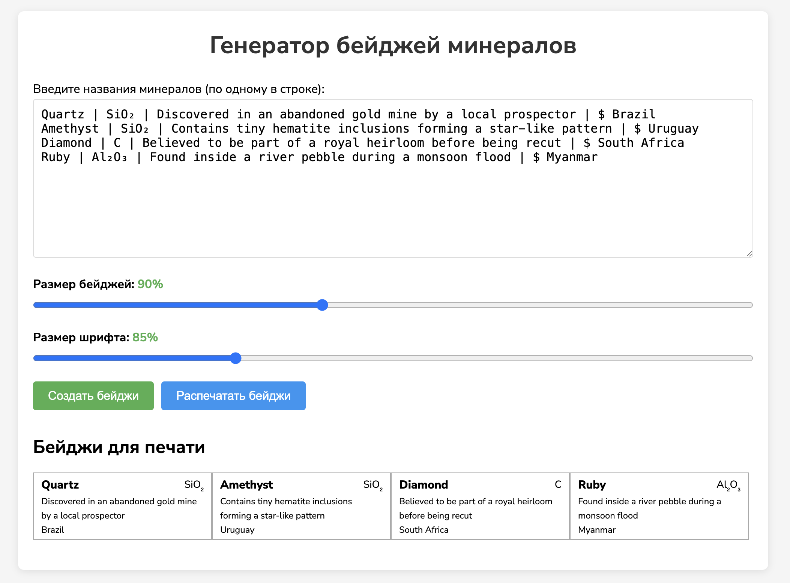

# Генератор Минеральных Бейджей

Веб-приложение для создания печатных бейджей минералов с названиями, химическими формулами, описаниями и местами происхождения.



## Возможности

- Ввод информации о минералах в структурированном формате
- Поддержка названия минерала, химической формулы, описания и места происхождения
- Редактирование отдельных бейджей минералов с помощью удобного модального интерфейса
- Настройка размера бейджей и размера шрифта с помощью ползунков
- Генерация визуальных бейджей для каждого минерала
- Печать бейджей для физической маркировки
- Адаптивный дизайн для разных размеров экрана
- Удобный для печати макет
- Автоматическое сохранение ваших данных и настроек с использованием localStorage

## Как использовать

1. Откройте `index.html` в любом современном веб-браузере
2. Введите информацию о минералах в текстовое поле, используя следующий формат:
   - `Название | Формула | Описание $ Местоположение`
   - Символ вертикальной черты `|` разделяет название, формулу и описание
   - Знак доллара `$` отделяет основную информацию от местоположения
   - Вы можете удобно копировать данные из Excel, если они разбиты по столбцам, но разделители `|` и `$` всё равно должны присутствовать (их можно добавить в виде отдельных столбцов в Excel)
3. Нажмите кнопку "Создать бейджи"
4. Просмотрите сгенерированные бейджи
5. Нажмите на любой бейдж, чтобы отредактировать его детали
6. При необходимости настройте размер бейджа и размер шрифта с помощью ползунков
7. Нажмите кнопку "Печать бейджей" для печати или сохранения в формате PDF

## Пример ввода

```
Кварц | SiO₂ | Прозрачный кристалл $ Бразилия
Аметист | SiO₂ | Фиолетовая разновидность кварца $ Уругвай
Алмаз | C | Самый твердый природный материал $ Южная Африка
Рубин | Al₂O₃ | Красная разновидность корунда $ Мьянма
Изумруд | Be₃Al₂(SiO₃)₆ | Зеленая разновидность берилла $ Колумбия
```

## Настройка

Вы можете настроить внешний вид бейджей, изменив CSS в файле `styles.css`:

- Измените размеры бейджей, модифицируя ширину и высоту `.mineral-badge`
- Настройте цвета, шрифты и отступы по необходимости
- Измените настройки макета печати в разделе `@media print`

## Хранение данных

Приложение автоматически сохраняет:
- Ваш текстовый ввод минералов
- Настройки размера бейджей
- Настройки размера шрифта

Эти данные хранятся в localStorage вашего браузера, поэтому они сохранятся между сессиями.

## Совместимость с браузерами

Это приложение работает во всех современных браузерах, включая:
- Chrome
- Firefox
- Safari
- Edge